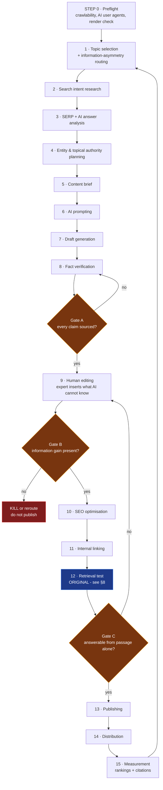

# AI-Powered SEO Content Production Playbook

**Version:** 1.0 · **Author:** Kapil · **Date:** 08 August 2026
**Status:** Operational draft. Sections marked ⚠️ rest on thin evidence — read [§9 Weaknesses](#9-weaknesses-of-this-playbook) before relying on them.

---

## A note on sourcing, up front

Every quotation in this document comes from a machine transcript of a published
talk, stored in [`/research/youtube-transcripts/`](./research/youtube-transcripts/).
Each citation names the file so any claim can be checked against the source text.

**I do not quote the LinkedIn files in this repository.** During collection,
LinkedIn blocked automated retrieval and the "excerpt" blocks in
[`/research/linkedin-posts/`](./research/linkedin-posts/) were reconstructed from
search-result summaries rather than transcribed. Several statistics in them —
including a "51% of B2B buyers" figure and an AngelList case study — could not be
traced to any primary source and are **not used here**. The full audit is in
[`research/SOURCE-AUDIT.md`](./research/SOURCE-AUDIT.md).

Transcripts are auto-generated and mangle proper nouns ("Moscon" → MozCon,
"Alita Solis" → Aleyda Solís, "Samrush" → Semrush). I correct these silently in
quotations and add punctuation where auto-captions omit it. Nothing else is altered.

---

## 1. Introduction

### Purpose

This is an operating manual for producing SEO content with AI assistance at a
rate a small team can sustain, without producing the kind of output that Google's
2024–2025 quality systems demote and that AI answer engines decline to cite.

It exists because the default failure mode is now well documented: AI removes the
cost constraint on publishing, teams respond by publishing more, and the marginal
value of each piece falls to roughly zero. This playbook is structured to prevent
that specific outcome.

### Audience

A growth or content team of 1–5 people who own organic acquisition for a
product, who have access to at least one genuine subject-matter expert, and who
can publish on their own site without a committee.

### Scope

| In scope | Out of scope |
|---|---|
| Blog articles, comparison pages, use-case and solution pages | Paid search, paid social |
| Topic selection through post-publish measurement | Brand/creative campaigns |
| Optimising for both Google results and AI answer citations | Site migrations, replatforming |
| Human review as a production gate | Link buying, PBNs, any grey-hat tactic |

### Goals

1. Publish content that ranks in Google **and** is retrievable by AI answer engines.
2. Keep human effort concentrated where it changes the outcome, not spread evenly.
3. Make quality a **gate** rather than an aspiration — something that blocks a publish.
4. Build a measurement layer for AI visibility, because the traffic metric alone
   is becoming a lagging and partial indicator.

---

## 2. Guiding Principles

These are the positions that recur across independent sources. Where sources
conflict, that conflict is handled in [§7](#7-where-experts-disagree) rather than
smoothed over here.

### 2.1 AI search runs on top of traditional search, not instead of it

This is the single most load-bearing principle in the playbook, and it is the one
with the strongest evidence behind it.

Large language models do not answer from memory when the question is current.
They retrieve. Bernard Huang describes the mechanism concretely:

> "Models, when performing answers for users, will likely ground with Google
> search. And that's because the knowledge cutoff or training data associated
> with models is usually out of date. Therefore, models need to search to
> understand whether or not there are new topics, concepts, trends [...] before
> responding to the end user."

*Source: Bernard Huang, "How To Do AEO: Prompt Research, Query Fan Out, Content" (Clearscope live session), listed Feb 2026 — [`bernard-huang-how-to-do-aeo-prompt-research-query-fan-out-content-live-ses.md`](./research/youtube-transcripts/bernard-huang-how-to-do-aeo-prompt-research-query-fan-out-content-live-ses.md) · https://www.youtube.com/watch?v=RMg2eTZL7Jk*

Lily Ray reports the same mechanism from the retrieval side, citing Britney
Müller's finding that "every single URL that you see in an LLM output actually
comes from a search engine API, Google or Bing," and concluding: "in order to
appear across these different LLMs, you need to appear in search engines first."

*Source: Lily Ray, "GEO, AEO, LLMO: Separating Fact from Fiction" (MozCon 2025 online adaptation), listed Nov 2025 — [`lily-ray-geo-aeo-llmo-separating-fact-from-fiction-mozcon-2025.md`](./research/youtube-transcripts/lily-ray-geo-aeo-llmo-separating-fact-from-fiction-mozcon-2025.md) · https://www.youtube.com/watch?v=2nJkT8zOzcM*

Aleyda Solís states the same conclusion from the technical-SEO side: "The
principles in SEO remain also in AI search."

*Source: Aleyda Solís, "AI Search Crawlability and Why Your Site's Tech Foundations Decide Visibility," listed 2025 — [`aleyda-solis-ai-search-crawlability-and-why-your-site-tech-foundations-de.md`](./research/youtube-transcripts/aleyda-solis-ai-search-crawlability-and-why-your-site-tech-foundations-de.md) · https://www.youtube.com/watch?v=pqrwpXpMM6s*

> **Operating consequence:** Do not build a second content process for "GEO."
> Build one process that produces retrievable content, and add a second
> *measurement* layer. This distinction is the resolution to [Disagreement 2](#72-disagreement-2--is-aeogeo-a-separate-discipline).

### 2.2 Trust is a ranking input, not a brand nicety

Kevin Indig argues that trust has become the core selection criterion in AI
experiences, and grounds it in an unusual source — Google's disclosures under the
US Department of Justice antitrust litigation:

> "Google is [...] more or less forced to explain how they went about ranking for
> many years. And one of the surprising findings is that Google has looked at
> clicks and user behaviour for way longer than we thought."

and:

> "Users select sources or search results based on whether they trust the brand
> or the company, and then whether they think it answers their question. [...]
> One of the big aspects of succeeding in this AI world [...] is really a
> trust-first mindset."

*Source: Kevin Indig, "The SEO Playbook for the AI Age," listed May 2025 — [`kevin-indig-the-seo-playbook-for-the-ai-age-with-kevin-indig.md`](./research/youtube-transcripts/kevin-indig-the-seo-playbook-for-the-ai-age-with-kevin-indig.md) · https://www.youtube.com/watch?v=eepyi-NYFiM*

Indig's assessment of whether the fundamentals shifted with AI: **"that
fundamental is stable."**

### 2.3 AI is acceptable where you have nothing to add, and dangerous where you do

Mordy Oberstein draws the cleanest line in the entire source set. He is not an
AI-content opponent:

> "There's nothing wrong with AI and there's nothing wrong with AI content. It's
> all what you do with [it]."

His test is whether you have information to contribute. On a saturated commodity
topic — his example is how to change a tyre — he is content to let AI handle it:
"there's probably nothing new I can add to that conversation at this point."

The failure case is the inverse, and it is a factual failure rather than a
stylistic one:

> "Take the very same example and let's say there's new technology that emerges,
> in which case the answer to that question changes. AI is not going to know that
> for a while. It's going to have to re-scrape everything, and it's not going to
> know the answer to that until everybody starts updating their content."

*Source: Mordy Oberstein, "SEO Branding and AI Content," listed Jan 2023 — [`mordy-oberstein-seo-branding-and-ai-content-with-mordy-oberstein-head-of-seo.md`](./research/youtube-transcripts/mordy-oberstein-seo-branding-and-ai-content-with-mordy-oberstein-head-of-seo.md) · https://www.youtube.com/watch?v=npmVxc_5Tqo*

He also names the underlying market dynamic honestly — AI writing tools "solve
such a powerful pain point," because "writing content [...] is very, very hard,"
and so adoption will outrun judgement.

> **Operating consequence:** Route topics by information asymmetry. Where you
> hold information the training corpus does not, AI drafts but a human supplies
> the substance. Where you hold nothing, either skip the topic or accept that
> you are producing a commodity and price your effort accordingly. This becomes
> the routing decision in [Step 1](#step-1--topic-selection).

### 2.4 Write atomic answers; do not try to engineer the chunking

Lily Ray's treatment of "chunking" is the most useful debunking in the source set,
because it separates a real practice from a fashionable one:

> "Chunk optimisation isn't really an SEO tactic. It's an AI engineering
> function. Large language models don't see your pretty formatting. They see
> tokens, or tiny units of meaning. They, not you, decide how to slice your
> content. There's not really any cheat code that you can use to chunk your
> content for AI Overviews, because every model chunks differently."

What she says *is* in your control:

> "Create clear, self-contained, atomic answers that stand on their own, whether
> a human being reads them or an AI extracts them."

She further reports that Google's John Mueller characterises optimising pages for
embeddings as "literally [...] keyword stuffing, which is a form of spam in
Google search."

*Source: Lily Ray, MozCon 2025 — [`lily-ray-geo-aeo-llmo-separating-fact-from-fiction-mozcon-2025.md`](./research/youtube-transcripts/lily-ray-geo-aeo-llmo-separating-fact-from-fiction-mozcon-2025.md)*

### 2.5 Distribution is part of production, not a downstream afterthought

Ross Simmonds' four-part model — **Research → Creation → Distribution →
Optimisation** — treats distribution as a first-class stage. His argument is that
the platforms now surfacing as AI citations are the ones SEOs dismissed:

> "I was telling people back in 2018, 2019, you need to distribute your content.
> Everybody is getting all excited about Reddit, YouTube, Quora, LinkedIn, all of
> these sites showing up in the citations [...] Everybody in the SEO world said,
> 'This isn't SEO.' Well, welcome to the new age."

*Source: Ross Simmonds, "Content Distribution in the Age of AI," listed Oct 2025 — [`ross-simmonds-content-distribution-in-the-age-of-ai.md`](./research/youtube-transcripts/ross-simmonds-content-distribution-in-the-age-of-ai.md) · https://www.youtube.com/watch?v=VXxFJAg7YJw*

This is independently corroborated by Lily Ray from the retrieval side: LLMs "are
heavily influenced by Wikipedia, Reddit, and YouTube."

### 2.6 The technical floor for AI crawlers is *higher* than for Googlebot

The most concrete, immediately actionable finding in the research, and the one
most likely to be silently costing teams visibility:

> "[Google is] very sophisticated at [rendering] and they render JavaScript [...]
> but the reality is that AI crawlers don't do it at all. So if you rely on
> client-side rendered JavaScript for critical content or navigation and so on —
> well, this is information that AI crawlers won't see."

*Source: Aleyda Solís, "AI Search Crawlability" — [`aleyda-solis-ai-search-crawlability-and-why-your-site-tech-foundations-de.md`](./research/youtube-transcripts/aleyda-solis-ai-search-crawlability-and-why-your-site-tech-foundations-de.md)*

She adds that AI crawler user agents differ from Googlebot's, so allow-listing
must be checked at the hosting and CDN layer separately.

> **Operating consequence:** A site can rank in Google and be invisible to
> ChatGPT for a purely mechanical reason. This is checked once, at
> [Step 0](#step-0--preflight-run-once-then-quarterly), not per article.

---

## 3. The workflow at a glance



**Three gates, one kill switch.** The design intent is that Gate B can stop a
piece permanently. A workflow without a kill switch is a publishing schedule, not
a quality system.

---

## 4. Complete Step-by-Step SOP

### Step 0 · Preflight (run once, then quarterly)

| | |
|---|---|
| **Purpose** | Ensure AI crawlers can physically retrieve your content. Skipping this makes every later step worthless for AI visibility. |
| **Expected output** | A signed-off crawlability check; a list of any client-side-rendered critical content. |

**Actions**

- [ ] Confirm critical content and navigation are **server-rendered**, not client-side JS.
- [ ] Allow-list AI crawler user agents at hosting **and** CDN level — these are separate from Googlebot and are commonly blocked by default bot protection.
- [ ] Check `robots.txt` does not block AI user agents you intend to permit.
- [ ] Fetch a representative page with JavaScript disabled. If the body copy vanishes, AI crawlers see nothing.

**Common mistakes**
- Assuming Googlebot's rendering ability generalises. It does not.
- Testing only `robots.txt` while the CDN's bot-protection layer silently 403s AI agents.

> **Sources:** Aleyda Solís, "AI Search Crawlability and Why Your Site's Tech
> Foundations Decide Visibility," listed 2025 —
> [`aleyda-solis-...`](./research/youtube-transcripts/aleyda-solis-ai-search-crawlability-and-why-your-site-tech-foundations-de.md)
> · https://www.youtube.com/watch?v=pqrwpXpMM6s

---

### Step 1 · Topic selection

| | |
|---|---|
| **Purpose** | Choose topics where you can win, and decide *how much human effort* each deserves before any writing starts. |
| **Expected output** | A prioritised topic list, each tagged **A / B / C** by information asymmetry. |

**Actions**

1. Build the candidate list from keyword research, sales-call objections, support tickets, and competitor gaps.
2. Route every topic through the **information-asymmetry test** — the operational form of Mordy Oberstein's argument in [§2.3](#23-ai-is-acceptable-where-you-have-nothing-to-add-and-dangerous-where-you-do):

| Tier | Test | Treatment | Human cost |
|---|---|---|---|
| **A** | We hold data, customer evidence, or practitioner experience the training corpus does not | AI drafts structure only; expert supplies all substance | High — worth it |
| **B** | Well-covered topic, but we have a defensible angle or a fresher fact base | AI drafts; expert adds the differentiator; kill if no differentiator survives editing | Medium |
| **C** | Fully commoditised, we add nothing | Deprioritise. If published for coverage reasons, accept commodity status and spend minimal review | Low |

3. Kill C-tier topics unless they are structurally required to complete a topical cluster ([Step 4](#step-4--entity--topical-authority-planning)).

**Common mistakes**
- Sorting purely by volume and difficulty. That selects for exactly the commodity topics where AI output is worthless.
- Treating tier C as "easy wins." At scale they are the pages that make a site look like a content farm.

**Recommended tools** — any keyword tool you already own (Semrush / Ahrefs / GSC); the routing decision is human.

> **Sources:** Mordy Oberstein, "SEO Branding and AI Content," listed Jan 2023 —
> [`mordy-oberstein-...`](./research/youtube-transcripts/mordy-oberstein-seo-branding-and-ai-content-with-mordy-oberstein-head-of-seo.md)
> · https://www.youtube.com/watch?v=npmVxc_5Tqo
> Kevin Indig, "The SEO Playbook for the AI Age," listed May 2025 —
> [`kevin-indig-...`](./research/youtube-transcripts/kevin-indig-the-seo-playbook-for-the-ai-age-with-kevin-indig.md)

---

### Step 2 · Search intent research

| | |
|---|---|
| **Purpose** | Establish what the searcher actually wants, and which page experience satisfies it. |
| **Expected output** | Intent classification + the page type that matches it. |

Bernard Huang's B2B mapping is the most directly usable framework in the source
set. He sorts B2B queries into four page experiences: **topic clusters**
(everything-you-need-to-know guides), **articles/resources** (how-to,
benefits-of), **comparison pages**, and **use-case / solutions pages**. He also
names the political obstacle honestly — that many B2B software companies "don't
necessarily want to create the [...] top-10 list of email marketing software and
link out to or talk about your competitors," while acknowledging it is
nonetheless effective.

**Actions**
- [ ] Classify intent: informational / commercial-investigation / transactional / navigational.
- [ ] Map to the matching page type above. Mismatches here cannot be fixed by better writing later.
- [ ] For commercial-investigation queries, decide the comparison-page question deliberately rather than by default avoidance.

**Common mistakes**
- Writing a guide for a comparison query. The intent mismatch caps the ceiling regardless of quality.

> **Sources:** Bernard Huang, "How to do B2B Content Strategy & SEO"
> (Clearscope Office Hours), listed 2024 —
> [`bernard-huang-how-to-do-b2b-content-strategy...`](./research/youtube-transcripts/bernard-huang-how-to-do-b2b-content-strategy-and-seo-clearscope-office-hou.md)
> · https://www.youtube.com/watch?v=VNXjG1OZxPw

---

### Step 3 · SERP **and AI answer** analysis

| | |
|---|---|
| **Purpose** | Understand what currently wins — in blue links *and* in the AI answer, which are different competitions. |
| **Expected output** | A SERP summary plus a **query fan-out list** and the domains currently cited. |

This is where the playbook diverges most from a pre-2024 SOP. Run the query
through an AI assistant with reasoning visible and capture the **query fan-out** —
the set of sub-searches the model performs to construct its answer.

Huang's demonstration is instructive: running a supply-chain software query, the
model's fan-out surfaced **G2 and Gartner** as explicitly cited sources, while the
client brand was absent entirely. That absence is the finding — it tells you the
gap is third-party presence, not on-site content.

**Actions**
- [ ] Record the top 10 organic results and the page type of each.
- [ ] Run the query in ChatGPT / Gemini / Perplexity. Capture: which domains are cited, whether you appear, and the fan-out sub-queries.
- [ ] Treat the fan-out list as a **content requirements list** — each sub-query is something your page (or cluster) must answer.
- [ ] Note whether review/aggregator sites (G2, Gartner, Capterra) dominate citations. If they do, on-site content alone will not close the gap.

**Common mistakes**
- Analysing the SERP and stopping. The AI answer is a separate competition with a partly different winner set.
- Running the query once. Citations are volatile; sample a few times.

**Recommended tools** — ChatGPT / Gemini / Perplexity with reasoning shown; Clearscope, Profound, or Peec for citation tracking (vendor-reported efficacy — see [§9](#9-weaknesses-of-this-playbook)).

> **Sources:** Bernard Huang, "How To Do AEO: Prompt Research, Query Fan Out,
> Content," listed Feb 2026 —
> [`bernard-huang-how-to-do-aeo...`](./research/youtube-transcripts/bernard-huang-how-to-do-aeo-prompt-research-query-fan-out-content-live-ses.md)
> · https://www.youtube.com/watch?v=RMg2eTZL7Jk
> Lily Ray, MozCon 2025, on query fan-out as an evolution of People Also Ask and
> long-tail research —
> [`lily-ray-geo-aeo-llmo...`](./research/youtube-transcripts/lily-ray-geo-aeo-llmo-separating-fact-from-fiction-mozcon-2025.md)

---

### Step 4 · Entity & topical authority planning

| | |
|---|---|
| **Purpose** | Decide the cluster this page belongs to, so coverage compounds instead of scattering. |
| **Expected output** | A topical map: cluster head, supporting pages, and the entities each must cover. |

Koray Tuğberk Gübür's contribution is the underlying model — that authority is
earned by covering a topic completely rather than by publishing individual strong
pages, and that the *sequence* of publication matters. His framing of topical
maps is the most developed treatment available, though it is also the least
accessible: in his own interview the host raises directly that "people say that
you over-complicate things."

Nick Jordan arrives at a compatible conclusion from a purely empirical direction —
his approach is described as winning "authority on the basis of producing a large
volume of content," with heavy emphasis on **internal linking** and **topical
relevance**. I adopt the topical-completeness and internal-linking half of his
model and reject the volume target; the reasoning is in
[Disagreement 1](#71-disagreement-1--volume-versus-selectivity) and
[§8 Rejected](#8-what-i-rejected-and-why).

**Actions**
- [ ] Define the cluster head and the supporting pages required for the cluster to be *complete*, not merely started.
- [ ] List entities (products, standards, competitors, named methods) each page must mention.
- [ ] Sequence publication: foundational/definitional pages before comparative and advanced ones.
- [ ] Merge the [Step 3](#step-3--serp-and-ai-answer-analysis) fan-out queries into the map — see [Original Idea 2](#idea-2--use-query-fan-out-as-the-topical-map-input).

**Common mistakes**
- Publishing the high-volume commercial page first and never completing the cluster beneath it.
- Building the map from keywords alone rather than from entities and questions.

> **Sources:** Koray Tuğberk Gübür, "How Topical Authority SEO Works," listed
> Mar 2024 —
> [`koray-tugberk-gubur-how-topical-authority-seo-works.md`](./research/youtube-transcripts/koray-tugberk-gubur-how-topical-authority-seo-works.md)
> · https://www.youtube.com/watch?v=pIKfKowzauQ
> Nick Jordan, "How Nick Jordan Grows Sites to Over 100k Organic Views a Month
> Without Link Building" —
> [`nick-jordan-how-nick-jordan-grows-sites...`](./research/youtube-transcripts/nick-jordan-how-nick-jordan-grows-sites-to-over-100k-organic-views-a-mon.md)
> · https://www.youtube.com/watch?v=wW_t3btaxAk
> ⚠️ *Attribution note: the "800 articles a month" and "down to 20 articles a
> month" figures are spoken by the host summarising Jordan's method in the
> episode introduction, not by Jordan directly.*

---

### Step 5 · Content brief

| | |
|---|---|
| **Purpose** | Front-load every decision that AI cannot make, so the draft stage is mechanical. |
| **Expected output** | A brief that a competent writer — or a model — could execute without further questions. |

**The brief must contain**

- [ ] Primary query + the fan-out sub-queries from [Step 3](#step-3--serp-and-ai-answer-analysis)
- [ ] Intent classification and page type from [Step 2](#step-2--search-intent-research)
- [ ] Tier (A/B/C) from [Step 1](#step-1--topic-selection) — this sets the review budget
- [ ] **The information-gain requirement, stated explicitly**: what will this page contain that no competing page contains? If this field is empty, the page is not ready to draft.
- [ ] Named author and why they are credible on this topic
- [ ] Entities that must appear
- [ ] Internal links in and out
- [ ] The atomic questions the page must answer in self-contained form

**Common mistakes**
- Treating the brief as a keyword list plus a word count. That produces exactly the interchangeable output that fails Gate B.
- Leaving the information-gain field blank and hoping it emerges in editing. It does not.

> **Sources:** Bernard Huang on information gain, "How to Rank SEO Content in the
> Era of Generative AI," listed Aug 2023 —
> [`bernard-huang-how-to-rank-seo-content...`](./research/youtube-transcripts/bernard-huang-how-to-rank-seo-content-in-the-era-of-generative-ai.md)
> · https://www.youtube.com/watch?v=ZytMamXMG0M
> Lily Ray on atomic answers, MozCon 2025 —
> [`lily-ray-geo-aeo-llmo...`](./research/youtube-transcripts/lily-ray-geo-aeo-llmo-separating-fact-from-fiction-mozcon-2025.md)

---

### Step 6 · AI prompting

| | |
|---|---|
| **Purpose** | Convert the brief into a draft without importing the model's generic priors. |
| **Expected output** | A draft that is structurally correct and factually flagged. |

**Practice**

- Supply the brief as context rather than describing it. Paste the fan-out queries, the entity list, and the information-gain requirement verbatim.
- Supply *your* raw material — interview notes, product data, support transcripts — and instruct the model to build from it. A model given nothing proprietary can only return the consensus of its training data, which is by definition what every competitor will also produce.
- Instruct the model to **mark every factual claim it cannot support from supplied material**. This turns [Step 8](#step-8--fact-verification) from an open-ended hunt into a checklist.
- Generate section by section against the brief's structure. Whole-article generation reverts to generic shape.

**Common mistakes**
- "Write a 2,000-word article about X." This is the single highest-volume failure mode in AI content production.
- Asking the model for facts it has no way to know — this is where fabrication enters.

⚠️ *Evidence note: no source in this research provides tested prompt templates or
comparative prompt efficacy data. This step is assembled from the sources'
principles plus practical inference, and is the least evidence-backed step in the
playbook.*

---

### Step 7 · Draft generation

| | |
|---|---|
| **Purpose** | Produce a complete draft, understood as raw material rather than as a near-final article. |
| **Expected output** | A sectioned draft with claims flagged for verification. |

Set the expectation explicitly with the team: the draft is the *cheapest* part of
the process and carries the *least* value. The value is added at Steps 8–9. Teams
that treat the draft as 90% done invert the economics that make this workflow
worthwhile.

**Common mistakes**
- Measuring team productivity in drafts produced. It measures the one input that is now nearly free.

---

### Step 8 · Fact verification — **Gate A**

| | |
|---|---|
| **Purpose** | Ensure no unverified claim reaches publication. |
| **Expected output** | Every factual claim either sourced, or cut. Binary. |

**Actions**
- [ ] Take the model's flagged claims plus every statistic, date, name, and citation.
- [ ] Verify each against a primary source. A second AI model is **not** verification — correlated training data produces correlated errors.
- [ ] Cut anything that cannot be sourced. Do not soften it into vagueness; cut it.
- [ ] Pay disproportionate attention to anything recent. Per Oberstein, a change in the underlying facts is precisely where models remain confidently wrong.

> **Practitioner note.** This playbook's own repository is a worked example of
> this failure. During research, unverifiable statistics were formatted as
> quotations and would have propagated into this document had they not been
> caught by exactly this check. See
> [`research/SOURCE-AUDIT.md`](./research/SOURCE-AUDIT.md). The gate is not
> theoretical.

**Common mistakes**
- Verifying with a second LLM.
- Verifying the surprising claims and trusting the mundane ones. Fabrications are usually mundane.

> **Sources:** Mordy Oberstein on AI and newly-changed facts, listed Jan 2023 —
> [`mordy-oberstein-seo-branding...`](./research/youtube-transcripts/mordy-oberstein-seo-branding-and-ai-content-with-mordy-oberstein-head-of-seo.md)

---

### Step 9 · Human editing — **Gate B (kill switch)**

| | |
|---|---|
| **Purpose** | Insert what the model structurally cannot know, and kill pieces where nothing was inserted. |
| **Expected output** | Either a piece carrying genuine information gain, or a killed topic. |

This is the step that determines whether the whole workflow produces an asset or
a liability. Oberstein's formulation is "peer-reviewed, meaning human-reviewed AI
work" — review as a condition of publishing, not a courtesy pass.

**The expert must add at least one of**

| Contribution | Why AI cannot supply it |
|---|---|
| Proprietary data or internal benchmarks | Not in training data |
| First-hand practitioner experience | Not in training data, and E-E-A-T's "Experience" |
| A named, defended opinion | Models regress to consensus |
| Correction of the consensus where it is wrong | Models reproduce the consensus |
| Current information post-dating the corpus | Structurally unavailable |

**Gate B rule:** if the editor cannot point at a specific passage that satisfies
one of these rows, **the piece does not publish.** Reroute to tier C or kill it.

**Common mistakes**
- Editing for tone and calling it review. Rewriting generic content in your voice leaves it generic.
- Allowing "we edited it thoroughly" to substitute for a named contribution.

> **Sources:** Mordy Oberstein, listed Jan 2023 —
> [`mordy-oberstein-seo-branding...`](./research/youtube-transcripts/mordy-oberstein-seo-branding-and-ai-content-with-mordy-oberstein-head-of-seo.md)
> Kevin Indig on trust-first positioning, listed May 2025 —
> [`kevin-indig-the-seo-playbook...`](./research/youtube-transcripts/kevin-indig-the-seo-playbook-for-the-ai-age-with-kevin-indig.md)

---

### Step 10 · SEO optimisation

| | |
|---|---|
| **Purpose** | Apply on-page fundamentals — as a floor, not as the strategy. |
| **Expected output** | An optimised page that would still be worth reading with the optimisation stripped out. |

Kyle Roof's testing work establishes that on-page technical signals carry more
weight than practitioners often assume — he reports maintaining pages ranking in
positions one and two built on placeholder Latin text "with the math done." His
own assessment of that as content advice, unprompted, is that it is "pretty
terrible."

The correct reading: **treat on-page precision as a floor you clear cheaply, not
as a substitute for substance.** Full reasoning in
[Disagreement 3](#73-disagreement-3--do-technical-on-page-signals-outrank-content-quality).

**Actions**
- [ ] Title, H1, headings reflect the query and the atomic questions
- [ ] Entities from [Step 4](#step-4--entity--topical-authority-planning) present
- [ ] Schema appropriate to page type (FAQ, HowTo, Article)
- [ ] Author markup pointing to a real, credentialed profile
- [ ] Answers placed high, in self-contained form
- [ ] **Do not** optimise for embeddings or engineer chunk boundaries ([§2.4](#24-write-atomic-answers-do-not-try-to-engineer-the-chunking))

> **Sources:** Kyle Roof, "EEAT and the Future of SEO with Artificial
> Intelligence," listed 2023 —
> [`kyle-roof-kyle-roof-talks-eeat...`](./research/youtube-transcripts/kyle-roof-kyle-roof-talks-eeat-and-the-future-of-seo-with-artificial-i.md)
> · https://www.youtube.com/watch?v=SniZRx1PXdg
> Lily Ray on embeddings-optimisation as spam, MozCon 2025 —
> [`lily-ray-geo-aeo-llmo...`](./research/youtube-transcripts/lily-ray-geo-aeo-llmo-separating-fact-from-fiction-mozcon-2025.md)

---

### Step 11 · Internal linking

| | |
|---|---|
| **Purpose** | Make the cluster legible as a structure rather than as a pile of pages. |
| **Expected output** | Every new page integrated into the cluster in both directions. |

Internal linking is one of the few tactics endorsed across otherwise
disagreeing sources — it is central to Jordan's volume model *and* to Gübür's
semantic model, which is reason to weight it.

**Actions**
- [ ] Link up to the cluster head, down to supporting pages, and laterally to siblings
- [ ] Descriptive anchor text — this is a relevance signal, not decoration
- [ ] Retrofit links **from** existing pages **to** the new one. Most teams skip this half and it is where most of the value sits.

---

### Step 12 · Retrieval test — **Gate C** 🔵 *(original — see [§8](#8-my-original-ideas))*

| | |
|---|---|
| **Purpose** | Verify empirically that the page's answers survive extraction, before publishing. |
| **Expected output** | Pass/fail per atomic answer block. |

Full rationale in [§8, Idea 1](#idea-1--the-retrieval-regression-test). In brief:
paste each atomic answer block in isolation into a model with web access
disabled, ask the target question, and check whether it can answer correctly
**from that passage alone**. Failures return to [Step 9](#step-9--human-editing--gate-b-kill-switch).

---

### Step 13 · Publishing

**Actions**
- [ ] Real author byline, real bio, real credentials, linked profile
- [ ] Accurate publish date. **Do not** back-date or bump dates without substantive change — Lily Ray specifically warns against what Google calls "artificial refreshening," noting Google "has ways of demoting this type of content."
- [ ] Confirm the published page is server-rendered ([Step 0](#step-0--preflight-run-once-then-quarterly))

> **Sources:** Lily Ray, MozCon 2025 —
> [`lily-ray-geo-aeo-llmo...`](./research/youtube-transcripts/lily-ray-geo-aeo-llmo-separating-fact-from-fiction-mozcon-2025.md)

---

### Step 14 · Content distribution

| | |
|---|---|
| **Purpose** | Build the third-party presence that both link-based ranking and citation-based retrieval depend on. |
| **Expected output** | Publication plus a distribution set, executed as one unit of work. |

Ross Simmonds' position is that distribution is not optional follow-up but part
of production. Lily Ray's retrieval-side observation — that LLMs are "heavily
influenced by Wikipedia, Reddit, and YouTube" — supplies the mechanism, and her
caution is worth reproducing: on Reddit "you can get banned if you're being
overly promotional," so contributions should be "authentic," including "honest
conversations when customers have problems with your brand."

**Actions**
- [ ] Reformat for each destination — YouTube, LinkedIn, Reddit, communities. Not link-drops.
- [ ] Where [Step 3](#step-3--serp-and-ai-answer-analysis) showed aggregators (G2, Gartner) dominating citations, treat presence there as a distribution objective in its own right.
- [ ] Produce at least one non-text format. Multimodal retrieval is real and video is disproportionately cited.

**Common mistakes**
- Posting the link and calling it distribution.
- Promotional Reddit activity, which is net-negative and can be account-fatal.

> **Sources:** Ross Simmonds, listed Oct 2025 —
> [`ross-simmonds-content-distribution-in-the-age-of-ai.md`](./research/youtube-transcripts/ross-simmonds-content-distribution-in-the-age-of-ai.md)
> Lily Ray, MozCon 2025 —
> [`lily-ray-geo-aeo-llmo...`](./research/youtube-transcripts/lily-ray-geo-aeo-llmo-separating-fact-from-fiction-mozcon-2025.md)

---

### Step 15 · Performance measurement

| | |
|---|---|
| **Purpose** | Measure both competitions — ranking and citation — without over-reacting to the smaller one. |
| **Expected output** | A dashboard covering traditional and AI-visibility metrics, with correct proportionality. |

**Traditional** — rankings, organic sessions, conversions, and the
impressions-up/clicks-down divergence Lily Ray calls the "Google Search Console
alligator mouth effect."

**AI visibility** — per Ray's proposed KPI set: branded impressions; share of
voice in AI search; direct and organic clicks to the homepage (LLM
recommendations often produce navigational rather than referral traffic); AI
visibility by topic; and engagement/conversion from AI-sourced traffic, grouped
into a custom GA4 segment.

> **Proportionality warning — this is the number most likely to be misused.**
> Ray reports that grouped LLM referral traffic remains small: Glenn Gabe
> observed roughly 1% on average across his clients, and Amsive "about one to
> maybe now 2%," against organic search that "for many sites could be 30, 40,
> 50% of their overall traffic." She also cites Semrush data indicating ChatGPT
> use *increases* Google usage — from 10.5 to 12.6 sessions per week — and
> Google's Robby Stein describing AI search as "expansionary."
>
> Budget accordingly. AI visibility is strategically important and currently
> small. Both halves of that sentence matter.

**Common mistakes**
- Reallocating budget on the basis of AI-search enthusiasm rather than measured contribution.
- Reading falling clicks as a content failure when impressions are rising — that is often the zero-click shift, not a quality problem.

> **Sources:** Lily Ray, MozCon 2025 (all figures above) —
> [`lily-ray-geo-aeo-llmo...`](./research/youtube-transcripts/lily-ray-geo-aeo-llmo-separating-fact-from-fiction-mozcon-2025.md)
> Brendan Hufford on click intent, listed 2025 —
> [`brendan-hufford-from-seo-to-aeo...`](./research/youtube-transcripts/brendan-hufford-from-seo-to-aeo-how-answer-engine-optimization-is-replacing.md)
> · https://www.youtube.com/watch?v=lMyYbBHXuG8

---

## 5. Cadence and staffing

Derived from the workflow above rather than from any single source, and offered
as a starting point to be calibrated:

| Team size | Sustainable A/B-tier output | Notes |
|---|---|---|
| 1 generalist | 2–4 pieces / month | Gate B is the bottleneck, and it should be |
| 2–3 with one SME | 6–10 / month | SME time is the constraint, not writing time |
| 5 with dedicated SMEs | 15–25 / month | Beyond this, review quality degrades before volume does |

The constraint is **expert review capacity**, not drafting capacity. Any plan
that treats drafting as the bottleneck is planning against the wrong constraint.

---

## 6. Quick reference checklist

```
PREFLIGHT
  □ Server-side rendering confirmed for critical content
  □ AI crawler user agents allow-listed (host + CDN)

PER PIECE
  □ Tier assigned (A/B/C) by information asymmetry
  □ Intent classified, page type matched
  □ Query fan-out captured; cited domains recorded
  □ Cluster + entities defined
  □ Brief written — information-gain field NOT empty
  □ Proprietary material supplied to the model
  □ Draft generated section-by-section
  □ GATE A · every claim verified against a primary source
  □ GATE B · named expert contribution present — else KILL
  □ On-page fundamentals applied (no embedding-gaming)
  □ Internal links, both directions, retrofitted
  □ GATE C · retrieval test passed
  □ Real author, real date, no artificial refreshening
  □ Distributed in ≥2 formats to ≥2 destinations
  □ Added to ranking + citation tracking
```

---
